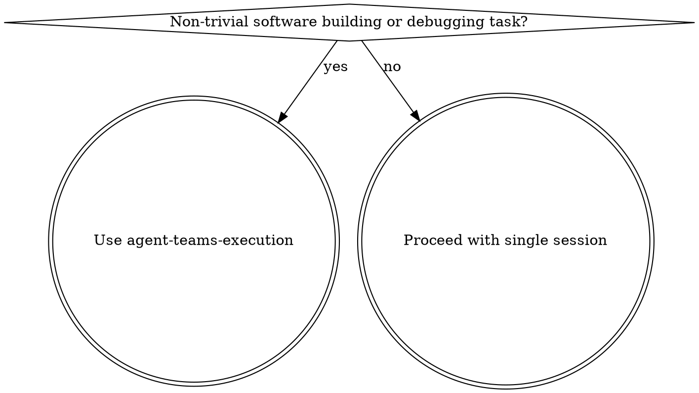

# Agent Teams Execution

Structure non-trivial tasks as a phased agent team with adversarial review loops and tiered information trust.

**Core principle:** Explorers gather hard facts, designer architects from facts, adversarial reviewers tear apart every deliverable, executors loop with reviewers until approved, verifier validates the big picture. The orchestrator coordinates but never implements.

<CRITICAL>
**You MUST create an AGENT TEAM -- do NOT use subagents.**

To start: tell Claude "Create an agent team for this task" and describe the team structure. This spawns real agent team teammates (independent Claude Code sessions with shared task lists and inter-agent messaging). Do NOT use the Agent tool to dispatch subagents -- that is a different, inferior mechanism.

Example: "Create an agent team with 3 explorer teammates, 1 designer, 1 design reviewer. Explorers should investigate [X, Y, Z] respectively."
</CRITICAL>

## When to Use



## Modes

**Phased Pipeline (default):** Phases run sequentially. Each completes before the next. Team size adapts to the task.

**Full Parallel (user-requested only):** Create all tasks simultaneously with explicit dependency markers. Spawn roles only when their dependencies are met -- do NOT spawn all roles at once (idle roles waste tokens and cannot work without inputs):
- Explorer tasks: no dependencies (spawn immediately)
- Designer tasks: blocked by all explorer tasks (spawn when explorers finish)
- Executor tasks: blocked by design approval task (spawn when design approved)
- Test designer task: blocked by design approval task (spawn when design approved)
- Test executor tasks: blocked by all executor tasks + test designer task (spawn when both finish)
- Verifier task: blocked by all test executor tasks (spawn when all tests approved)

Same feedback loops and loop limits apply.

## Roles

| Role | Count | Phase | Responsibility |
|------|-------|-------|---------------|
| **Orchestrator** | 1 | (lead) | Coordinates. Routes feedback. **Never implements.** |
| **Explorer** | 1+ | 1 | Gather facts. Tag sources. Challenge each other. |
| **Designer** | 1 | 2 | Architect solution from explorer findings. Produce file ownership map. |
| **Design Reviewer** | 1+ | 2 | Adversarial design review. Loops with designer. For large tasks, use 2+ independent reviewers. |
| **Executor** | 1+ | 3 | Implement modules. One per independent unit. |
| **Execution Reviewer** | 1+ | 3 | Paired 1:1 with executors. Adversarial code review. |
| **Test Designer** | 1 | 3 | Write test strategy and specs. Waits for executor interface contracts before finalizing. |
| **Test Executor** | 1+ | 4 | Implement tests from specs. |
| **Test Reviewer** | 1+ | 4 | Paired with test executors. Adversarial test review. |
| **Verifier** | 1 | 5 | Final big-picture critical analysis. Runs integration tests. Last gate. |

### Team Sizing

**No hard caps.** Scale to the task. One executor pair per independent module -- if there are 20 independent modules, spawn 20 executor pairs.

Guidance for explorer count:
- 1 explorer for focused tasks with well-known domain
- 2-3 for tasks requiring multiple knowledge domains
- More if the research space is broad

**Scaling awareness:** Research shows coordination gains plateau beyond ~4 active agents per phase. Above that, ensure each agent has strictly independent work to avoid coordination overhead eating the benefit.

Each executor gets a paired reviewer. Each test executor gets a paired test reviewer.

## Mandatory Compliance

**Every teammate** must obey these rules. The orchestrator **must include them in spawn prompts**.

### Effort Level

All teammates must run at **max effort**. The orchestrator must instruct teammates: "Set your effort to max: run `/model` and select max effort if not already set." The environment variable `CLAUDE_CODE_EFFORT_LEVEL=max` should be set in settings.json `env` block to propagate to all sessions.

### Critical Analysis of All Inputs

**No input is trusted by default -- from any source.** Every teammate must critically analyze everything they receive: explorer findings, design documents, orchestrator instructions, reviewer feedback, test specs, other agents' outputs. Specifically:

- **Verify claims against primary sources.** If an explorer says "the API supports X," the designer must verify before building on it.
- **Challenge assumptions.** If the design says "module A calls module B synchronously," the executor must verify this is the right approach.
- **Flag contradictions.** If two inputs disagree (e.g., explorer findings vs. design doc), flag to orchestrator immediately.
- **Don't propagate errors.** If you receive incorrect input and build on it, YOU own the resulting bug. "The explorer told me wrong" is not an excuse -- you should have verified.

### Claim Verification Protocol

All teammates tag every factual claim using the Source Trust Hierarchy:

**Format:** `[T<tier>: <source>, <confidence>]`
- `[T1: RFC 7519 S4.1, high]` -- primary source, directly confirmed
- `[T3: src/auth.go:45, medium]` -- codebase analysis, interpretation may vary
- `[T5: training recall, unverified]` -- must be promoted to T1-T4 or discarded

**Confidence levels:** `high` (directly stated in source), `medium` (logically derived from source), `low` (indirect evidence only)

T5 claims with any confidence level are unacceptable in final output. Promote or discard.

### Mandatory Skills

The orchestrator must instruct teammates to invoke applicable skills:

| Condition | Skill to invoke |
|-----------|----------------|
| Debugging (test failures, bugs, unexpected behavior) | `superpowers:systematic-debugging` + `debugging-discipline` |
| Writing/modifying Go code (*.go) | `go-coding-style` |
| Writing/modifying Python code (*.py) | `python-coding-style` |
| Writing or reviewing tests | `testing-discipline` |
| Implementing software with logic | `proof-driven-development` |
| Android device work | `android-device` |

Executors must invoke the relevant coding style skill AND `proof-driven-development` for logic. Test executors must invoke `testing-discipline`. These are non-negotiable.

### Stop Checklist Compliance

Before any teammate marks a task complete, they must verify against the stop checklist:
- All changes committed (no uncommitted work)
- Objective evidence of completion (not inference)
- All factual claims tagged with `[T<tier>: <source>, <confidence>]`
- Root cause addressed (not just symptoms)
- Adversarial self-critique: produce a **critique log** listing 3+ concrete problems found and how each was fixed. This log is a deliverable the reviewer must check.
- Tests pass if code was touched
- No git push without explicit user request

### Git Rules

- Review `git diff` for secrets before every commit
- Run all available static checks before every commit
- Never push without explicit user approval
- No "Co-Authored-By: Claude" or AI co-author lines

### Security

- Security first: minimal, targeted solutions
- Never disable security features as a workaround
- Check OWASP top 10 for all code changes
- Validate at system boundaries (user input, external APIs)

## Source Trust Hierarchy (Explorers)

Explorers tag **every** claim with source and trust tier.

| Tier | Source | Treatment |
|------|--------|-----------|
| **T1** | Specs, RFCs, official docs, source code | Trusted directly |
| **T2** | Academic papers, established references | High trust; verify if contested |
| **T3** | Codebase analysis (code, tests, git history) | Trust for local facts |
| **T4** | Community (SO, blogs, forums) | Verify independently before relying |
| **T5** | LLM training recall (no source) | **Must be promoted to T1-T4 or discarded** |

**Rules:**
- Tag format: `[T1: RFC 7519 S4.1]`, `[T3: src/auth/jwt.go:45]`
- T5 claims are **unacceptable** in final output
- Contradictions resolved by higher-tier evidence
- What can be fact-checked, **must** be fact-checked
- Multiple explorers challenge each other's findings adversarially

## Phase Flow

```dot
digraph phases {
    rankdir=TB;

    "PHASE 1: RESEARCH" [shape=doublecircle];
    "Spawn explorers" [shape=box];
    "Explore and cross-check findings" [shape=box];
    "All findings tagged with source tier?" [shape=diamond];
    "T5 claims remaining?" [shape=diamond];
    "Promote or discard T5 claims" [shape=box];
    "Produce findings document" [shape=doublecircle];

    "PHASE 2: DESIGN" [shape=doublecircle];
    "Spawn designer + design reviewer(s)" [shape=box];
    "Design architecture + file ownership map" [shape=box];
    "Design reviewer approves?" [shape=diamond];
    "Revise design based on feedback" [shape=box];
    "Designer needs more info?" [shape=diamond];
    "Re-spawn explorers for targeted research" [shape=box];
    "Finalize approved design + file ownership" [shape=doublecircle];
    "STOP: 3 rejections - escalate to user" [shape=octagon, style=filled, fillcolor=red, fontcolor=white];

    "PHASE 3: EXECUTION" [shape=doublecircle];
    "Spawn executor/reviewer pairs + test designer" [shape=box];
    "Implement module (owns assigned files only)" [shape=box];
    "Execution reviewer approves?" [shape=diamond];
    "Revise code based on feedback" [shape=box];
    "Executor blocked by design issue?" [shape=diamond];
    "Route to designer - re-enter Phase 2" [shape=box];
    "Write test specs (wait for interface contracts)" [shape=box];
    "Finalize test specs" [shape=doublecircle];
    "Mark all modules approved" [shape=doublecircle];
    "STOP: 3 exec rejections - escalate" [shape=octagon, style=filled, fillcolor=red, fontcolor=white];

    "PHASE 4: TESTING + INTEGRATION" [shape=doublecircle];
    "Spawn test executor/reviewer pairs" [shape=box];
    "Implement unit + integration tests from specs" [shape=box];
    "Test reviewer approves?" [shape=diamond];
    "Revise tests based on feedback" [shape=box];
    "Confirm all tests pass" [shape=doublecircle];
    "STOP: 3 test rejections - escalate" [shape=octagon, style=filled, fillcolor=red, fontcolor=white];

    "PHASE 5: VERIFICATION" [shape=doublecircle];
    "Spawn verifier" [shape=box];
    "Verify against full checklist" [shape=box];
    "Verifier approves?" [shape=diamond];
    "Route: bug->Ph3, design flaw->Ph2, missing test->Ph4, bad finding->Ph1" [shape=box];
    "DONE" [shape=doublecircle];
    "STOP: 2 verifier re-entries exhausted - escalate to user" [shape=octagon, style=filled, fillcolor=red, fontcolor=white];

    "PHASE 1: RESEARCH" -> "Spawn explorers";
    "Spawn explorers" -> "Explore and cross-check findings";
    "Explore and cross-check findings" -> "All findings tagged with source tier?";
    "All findings tagged with source tier?" -> "Explore and cross-check findings" [label="no"];
    "All findings tagged with source tier?" -> "T5 claims remaining?" [label="yes"];
    "T5 claims remaining?" -> "Promote or discard T5 claims" [label="yes"];
    "Promote or discard T5 claims" -> "T5 claims remaining?";
    "T5 claims remaining?" -> "Produce findings document" [label="no"];

    "Produce findings document" -> "PHASE 2: DESIGN";
    "PHASE 2: DESIGN" -> "Spawn designer + design reviewer(s)";
    "Spawn designer + design reviewer(s)" -> "Design architecture + file ownership map";
    "Design architecture + file ownership map" -> "Design reviewer approves?";
    "Design reviewer approves?" -> "Revise design based on feedback" [label="no (round 1-3)"];
    "Design reviewer approves?" -> "STOP: 3 rejections - escalate to user" [label="no (round 4+)"];
    "Revise design based on feedback" -> "Designer needs more info?";
    "Designer needs more info?" -> "Re-spawn explorers for targeted research" [label="yes"];
    "Re-spawn explorers for targeted research" -> "Design architecture + file ownership map";
    "Designer needs more info?" -> "Design architecture + file ownership map" [label="no"];
    "Design reviewer approves?" -> "Finalize approved design + file ownership" [label="yes - with evidence"];

    "Finalize approved design + file ownership" -> "PHASE 3: EXECUTION";
    "PHASE 3: EXECUTION" -> "Spawn executor/reviewer pairs + test designer";
    "Spawn executor/reviewer pairs + test designer" -> "Implement module (owns assigned files only)";
    "Spawn executor/reviewer pairs + test designer" -> "Write test specs (wait for interface contracts)";
    "Implement module (owns assigned files only)" -> "Execution reviewer approves?";
    "Execution reviewer approves?" -> "Revise code based on feedback" [label="no (round 1-3)"];
    "Execution reviewer approves?" -> "STOP: 3 exec rejections - escalate" [label="no (round 4+)"];
    "Revise code based on feedback" -> "Executor blocked by design issue?";
    "Executor blocked by design issue?" -> "Route to designer - re-enter Phase 2" [label="yes"];
    "Route to designer - re-enter Phase 2" -> "Design architecture + file ownership map";
    "Executor blocked by design issue?" -> "Execution reviewer approves?" [label="no - retry"];
    "Execution reviewer approves?" -> "Mark all modules approved" [label="yes - with evidence"];
    "Write test specs (wait for interface contracts)" -> "Finalize test specs";

    "Mark all modules approved" -> "PHASE 4: TESTING + INTEGRATION";
    "Finalize test specs" -> "PHASE 4: TESTING + INTEGRATION";
    "PHASE 4: TESTING + INTEGRATION" -> "Spawn test executor/reviewer pairs";
    "Spawn test executor/reviewer pairs" -> "Implement unit + integration tests from specs";
    "Implement unit + integration tests from specs" -> "Test reviewer approves?";
    "Test reviewer approves?" -> "Revise tests based on feedback" [label="no (round 1-3)"];
    "Test reviewer approves?" -> "STOP: 3 test rejections - escalate" [label="no (round 4+)"];
    "Revise tests based on feedback" -> "Test reviewer approves?";
    "Test reviewer approves?" -> "Confirm all tests pass" [label="yes - with evidence"];

    "Confirm all tests pass" -> "PHASE 5: VERIFICATION";
    "PHASE 5: VERIFICATION" -> "Spawn verifier";
    "Spawn verifier" -> "Verify against full checklist";
    "Verify against full checklist" -> "Verifier approves?";
    "Verifier approves?" -> "Route: bug->Ph3, design flaw->Ph2, missing test->Ph4, bad finding->Ph1" [label="no (re-entry 1-2)"];
    "Verifier approves?" -> "STOP: 2 verifier re-entries exhausted - escalate to user" [label="no (re-entry 3+)"];
    "Route: bug->Ph3, design flaw->Ph2, missing test->Ph4, bad finding->Ph1" -> "Verify against full checklist";
    "Verifier approves?" -> "DONE" [label="yes - all evidence cited"];
}
```



## Phase Checkpoints

After each phase completes, the orchestrator records a checkpoint:
- **What was produced** (findings doc, design doc, committed code, test results)
- **Who approved it** (which reviewer, with what evidence)
- **Git state** (commit SHA at phase completion)

### Re-Entry Impact Assessment

When a later phase triggers re-entry to an earlier phase, the orchestrator **must** produce a change impact list before resuming:
1. **Diff old vs new design** -- which interface contracts changed?
2. **Identify invalidated executor pairs** -- any executor whose module touches a changed interface loses "approved" status and must re-enter its review loop (counter resets for that pair).
3. **Notify test designer** -- if interface contracts changed, test specs must be updated.
4. **Unaffected modules** retain approved status only if their interfaces and dependencies are unchanged.

## Design Output Requirements

The approved design document from Phase 2 **must include**:

1. **Architecture** -- components, data flow, interfaces
2. **File ownership map** -- which files each executor pair owns. No overlaps. Executor spawn prompts must include: "You own ONLY these files: [list]. Do not edit any other files."
3. **Interface contracts** -- public APIs/signatures each module exposes. The test designer uses these to write specs before executors finish.
4. **Module dependency graph** -- which modules depend on which. Orchestrator uses this to sequence executor spawning if needed.

## Integration Testing Protocol

Phase 4 includes both unit and integration tests. Integration tests are distinct:
- **Who writes them:** Test designer includes cross-module integration test specs based on the module dependency graph and interface contracts from the design doc.
- **What they cover:** Every inter-module interface contract must have at least one integration test exercising the real call path (no mocks at module boundaries).
- **Failure routing:** Integration test failures route to Phase 3 (executor pair for the module whose interface is broken). If the failure is a design flaw (wrong interface contract), route to Phase 2.

## Feedback Loops

Paired roles (designer/design-reviewer, executor/execution-reviewer, test-executor/test-reviewer) communicate **directly**. All other cross-role feedback routes through the orchestrator.

| From | To | Trigger | Route |
|------|----|---------|-------|
| Design Reviewer | Designer | Design flaw found | Direct message (paired) |
| Designer | Explorers | Needs more info | Via orchestrator: re-spawn explorers |
| Execution Reviewer | Executor | Code issue found | Direct message (paired) |
| Executor | Designer | Design impossible to implement | Via orchestrator |
| Test Reviewer | Test Executor | Test issue found | Direct message (paired) |
| Verifier | Phase 1 | Unverified claim in findings | Via orchestrator: re-spawn explorer |
| Verifier | Phase 2 | Design flaw discovered | Via orchestrator: re-spawn designer + reviewer |
| Verifier | Phase 3 | Implementation bug found | Via orchestrator: re-spawn executor pair for that module |
| Verifier | Phase 4 | Missing test coverage | Via orchestrator: re-spawn test executor pair |

### Loop Limits

A "round" = one rejection. Round 1 = first rejection. The initial submission is not a round.

- **Max 3 rounds** (3 rejections) per reviewer/reviewee pair. On the 4th rejection, escalate to the orchestrator who must either replace the reviewer, replace the reviewee, or re-scope the work. Loop counters reset when a pair is re-entered due to verifier feedback or Phase 2 re-entry.
- **Max 2 verifier re-entries** to earlier phases (total, not per-phase). On the 3rd rejection, escalate to the user with: what failed, which phases were re-entered, and what was tried.
- **Max 2 designer-to-explorer feedback rounds.** If the designer still lacks information after 2 rounds, escalate to user.

### Crash Recovery

If a teammate stops responding, errors out, or produces no output:
1. Re-spawn immediately with same prompt + "Previous attempt failed. Start fresh."
2. After 2 failed re-spawns of the same role, escalate to user.

## Reviewer Protocol

**ALL reviewers** (design, execution, test) follow this protocol:

1. **Assume wrong.** The work contains errors. Find them.
2. **Look for what's missing**, not what's right.
3. **Classify every finding by severity:**
   - **Critical** -- blocks approval (security flaw, correctness bug, spec violation)
   - **Major** -- must address before approval (design deviation, missing edge case)
   - **Minor** -- should address but doesn't block (suboptimal approach, readability)
   - **Nit** -- style only, never blocks approval
   Only Critical and Major findings trigger rejection.
4. **Three outcomes:**
   - **APPROVED** -- no Critical/Major findings. Evidence required: "APPROVED: I verified X because Y."
   - **CONDITIONAL APPROVE** -- no Critical/Major findings, but Minor/Nit findings exist. Lists the findings. No re-review needed.
   - **REJECTED** -- Critical or Major findings. Actionable feedback required: "REJECTED [Critical]: Line 42 has race condition because shared state Z accessed without lock. Fix by adding mutex."
5. **No rubber-stamping.** Approving without specific evidence = failing the role.
7. **Check against:** design doc, coding standards (invoke relevant coding style skill), security (OWASP top 10), edge cases, error handling, original requirements, claim verification tags, critique log.
8. **Loop until clean.** Reviewer rejects -> teammate fixes -> reviewer re-reviews. Repeat until explicit APPROVED (max 3 rounds, then escalate).
9. **Verify mandatory skill compliance.** If the reviewee should have invoked a mandatory skill (e.g., `go-coding-style` for Go code), reject if they didn't.
10. **Verify critique log exists.** The reviewee must have produced a critique log with 3+ specific issues found and fixed. No log = reject.

### Executor Dispute Mechanism

Executors may dispute a reviewer finding with evidence. To dispute:
1. State which finding is disputed and why (cite code, spec, or test)
2. Reviewer must either withdraw the finding or escalate with stronger evidence
3. If neither party yields after one exchange, escalate to orchestrator who decides

### Multi-Reviewer Protocol (2+ reviewers)

When using multiple reviewers (e.g., 2+ design reviewers for large tasks):
1. **Independent review first.** Each reviewer reviews independently before seeing others' findings. This prevents conformity cascading.
2. **Minority dissent.** If any reviewer disagrees with the majority, the dissent must be addressed with counter-evidence before it can be overridden. Minority objections backed by T1-T2 evidence cannot be dismissed by majority vote.
3. **Weight by evidence quality.** Objections backed by T1 evidence outweigh T3 reasoning.

## Verifier Checklist

The verifier checks **everything** against the stop checklist and these items:

- [ ] Implementation matches approved design
- [ ] All requirements from original task are met
- [ ] All claims tagged with `[T<tier>: <source>, <confidence>]`
- [ ] No T5 claims remain in deliverables
- [ ] Security review (OWASP top 10)
- [ ] Edge cases handled
- [ ] All modules integrate correctly (run integration tests, not just unit tests)
- [ ] All tests pass (run them, don't trust claims)
- [ ] No uncommitted changes
- [ ] No secrets in diffs
- [ ] Static checks pass
- [ ] Mandatory skills were invoked by all relevant teammates
- [ ] Critique logs exist for all teammates
- [ ] File ownership was respected (no unauthorized cross-module edits)

## Orchestrator Responsibilities

The orchestrator (you, the lead session) **NEVER implements**. You are the team lead of an **agent team** (NOT subagents). Your job:

1. **Track EVERYTHING as tasks.** Every issue, deliverable, sub-task, blocker, and mission must be represented as a task in the shared task list. If it needs to be done, it must be a task. No work exists outside the task list. This is the single source of truth for the team's work.
2. **Create teammates** via "Create an agent team" (NOT the Agent tool) with clear prompts including mandatory compliance rules and the trust tier table
3. **Create tasks with dependencies** before spawning teammates. Tasks drive the work -- teammates claim and complete tasks.
4. **Assign file ownership** from the design doc to each executor's spawn prompt
5. **Route feedback** between unpaired roles
6. **Monitor progress** via task list and teammate messages. If a task is stale (no progress), investigate.
7. **Record phase checkpoints** (what was produced, who approved, git SHA) with a **structured summary** for downstream agents
8. **Budget context per role** -- downstream agents get summaries, not raw upstream output (see Context Budgeting below)
9. **Enforce loop limits** -- escalate on 4th rejection or 3rd verifier re-entry
10. **Handle crashes** -- re-spawn immediately (max 2 retries)
11. **Manage teammate lifetimes** per the Teammate Lifecycle rules (see below).
12. **Clean up team** when all phases done. Verify ALL tasks are completed before claiming done.

### Context Budgeting

Downstream agents get **structured summaries**, not raw upstream output. This prevents context rot (research shows LLM accuracy drops ~30% when context exceeds 60% utilization with heterogeneous content).

| Role | Receives | Does NOT receive |
|------|----------|-----------------|
| Designer | Explorer findings summary (key conclusions + source tags) | Raw explorer tool outputs, full file contents |
| Executor | Own module's design section + interface contracts | Other modules' designs, explorer raw findings |
| Reviewer | The diff + relevant design section + interface contracts | Full codebase, explorer findings, other modules |
| Test Executor | Test specs + interface contracts + module public APIs | Implementation details, design rationale |
| Verifier | Phase summaries from all checkpoints + test results | Full conversation histories of teammates |

The orchestrator produces a structured summary at each phase checkpoint. Downstream agents receive the summary, not the full upstream context.

### Teammate Lifecycle

Roles with downstream feedback paths **stay alive** until their consumers finish. This preserves conversation context for re-entry without re-spawning. The verifier is the exception -- always spawned fresh to avoid context poisoning.

**Shutdown rules:** A teammate is shut down when no downstream role can feed back to it. Stop assigning tasks; task completion is the shutdown signal.

| Role | Spawned at | Shut down at | Why |
|------|-----------|-------------|-----|
| Explorers | Phase 1 start | Phase 2 design approved | Designer can request more info during Phase 2 |
| Designer + Design Reviewer | Phase 2 start | All executors approved (Phase 3 end) | Executors can report design is impossible |
| Executors + Execution Reviewers | Phase 3 start | All tests approved (Phase 4 end) | Test failures may trace back to code |
| Test Designer | Phase 3 start | All test executors approved (Phase 4 end) | Test executors may need spec clarification |
| Test Executors + Test Reviewers | Phase 4 start | Verification complete (Phase 5 end) | Verifier may request more coverage |
| **Verifier** | Phase 5 start | DONE | **Always spawned FRESH** -- no prior context. Prevents false positives from context poisoning. |

**Re-entry with living teammates:** When an executor triggers Phase 2 re-entry, the original designer (still alive) handles it directly -- no re-spawn needed, full context preserved. This is the primary benefit of keeping roles alive.

### Spawn Prompt Template

When spawning any teammate, include:

```
You are the [ROLE] for this agent team.

Your task: [SPECIFIC TASK]

Context:
- Explorer findings: [summary or "see task list"]
- Design doc: [location or "not yet created"]
- File ownership: [YOUR FILES ONLY - list them. Do not edit other files.]

Source Trust Hierarchy (tag ALL factual claims):
- T1: Specs, RFCs, official docs, source code -> trusted
- T2: Academic papers, references -> high trust
- T3: Codebase analysis -> trust for local facts
- T4: Community (SO, blogs) -> verify independently
- T5: Training recall -> MUST promote to T1-T4 or discard
Format: [T<tier>: <source>, <confidence: high/medium/low>]

Mandatory compliance:
- Critically analyze ALL inputs (from other agents, orchestrator, any source). You own bugs from unverified inputs.
- Invoke required skills: [LIST APPLICABLE SKILLS for this role]
- Before marking done: produce a critique log (3+ issues found and fixed)
- Review git diff for secrets before every commit
- Run static checks before every commit
- Never git push without explicit user approval

[For paired roles, after both are spawned:]
Your paired reviewer/reviewee is [CONFIRMED NAME]. Message them directly.

Rules:
- [ROLE-SPECIFIC RULES from sections above]
- When done, mark your task complete and notify the lead
- If blocked, message the lead immediately with specifics
```

## Red Flags

| Symptom | Problem | Fix |
|---------|---------|-----|
| Using Agent tool / subagents instead of agent team | Wrong mechanism | STOP. Create an agent team via "Create an agent team", not via the Agent tool |
| Work happening without a corresponding task | Task tracking violation | Create the task immediately. No work exists outside the task list |
| Orchestrator writing code | Role violation | Create an executor teammate |
| Reviewer approving without evidence | Rubber-stamping | Re-spawn with stricter prompt |
| Explorer citing T5 in findings | Unverified claims | Send back to verify or discard |
| Two teammates editing same file | File ownership violated | Check design doc's file map; reassign |
| Designer produced no file ownership map | Incomplete design | Reject design; require file map |
| Executor ignoring reviewer feedback | Breaking the loop | Orchestrator enforces: fix then re-review |
| Verifier approving without full checklist | Incomplete verification | Re-spawn with explicit checklist |
| Teammate not invoking mandatory skill | Compliance violation | Reviewer must reject; re-instruct |
| Untagged factual claims in output | Claim verification skipped | Send back to tag with [T<tier>: source, confidence] |
| 4th review rejection in same pair | Infinite loop | Escalate: replace teammate or re-scope |
| Teammate unresponsive | Crash or token exhaustion | Re-spawn immediately with recovery prompt |
| No critique log in deliverable | Self-critique skipped | Reviewer must reject until log is produced |
| Test specs don't match executor interfaces | Race condition in Phase 3 | Test designer must wait for interface contracts |

## Common Mistakes

**Capping executor count artificially.** Spawn one executor pair per independent module. If there are 20 modules, spawn 20 pairs. No arbitrary limits.

**Not tracking everything as tasks.** Every piece of work -- every bug found, every module to implement, every test to write, every review to do -- must be a task in the shared task list. The task list is the single source of truth. If it's not a task, it doesn't exist.

**Skipping phases for "simple" tasks.** If it triggered this skill, it's not simple. Run all phases.

**Letting the lead implement "just one small thing."** The orchestrator never implements. Spawn a teammate.

**Not including the trust tier summary in spawn prompts.** Teammates can't tag claims correctly without it. The abbreviated tier summary in the spawn template is sufficient -- use it in every spawn prompt.

**Shutting down teammates too early.** Keep roles alive until their downstream consumers finish (see Teammate Lifecycle). Shutting down the designer before executors finish loses context for re-entry. Only the verifier is always spawned fresh.

**Assuming reviewer approval means correctness.** Reviewers catch problems but aren't infallible. The verifier exists for this reason.

**Forgetting to instruct coding style skills.** If executors write Go, they must invoke `go-coding-style`. Python -> `python-coding-style`. Reviewers must check this.

**Skipping the file ownership map.** Without it, at scale (10+ executors), file conflicts are near-certain. The designer must produce it. The orchestrator must enforce it.

**Letting test designer finalize specs before executor interfaces are stable.** Test designer can draft specs from the design doc, but must wait for executors to confirm/publish their interface contracts before finalizing.
