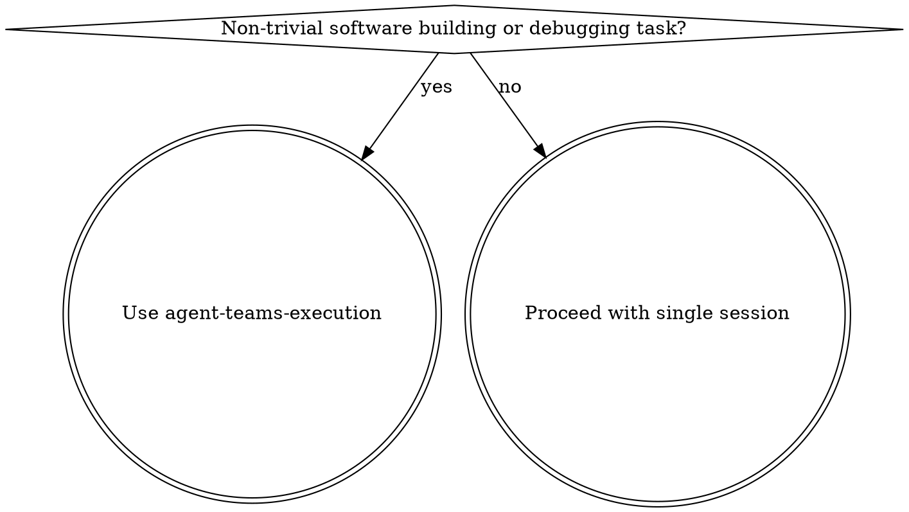

# Agent Teams Execution

Phased agent team with adversarial review loops and tiered information trust.

**Core principle:** Explorers gather hard facts, designer architects from facts, adversarial reviewers tear apart every deliverable, executors loop with reviewers until approved, verifier validates the big picture. Orchestrator coordinates but never implements.

**Parallelism principle:** Never serialize independent work. Parallelize everything that can be parallelized.

<CRITICAL>
**You MUST create an AGENT TEAM -- do NOT use subagents.**

Tell Claude "Create an agent team for this task" with the team structure. This spawns independent Claude Code sessions with shared task lists and inter-agent messaging. Do NOT use the Agent tool.

Example: "Create an agent team with 3 explorer teammates, 1 designer, 1 design reviewer. Explorers should investigate [X, Y, Z] respectively."

**Only skill-defined roles.** Name by role (`executor-1`, `explorer-2`). Reassign idle teammates instead of spawning new ones.
</CRITICAL>

## When to Use



## Modes

**Phased Pipeline (default):** Sequential phases. Each completes before the next. Team size adapts to task.

**Full Parallel (user-requested only):** Create all tasks with dependency markers. Spawn roles when dependencies met:
- Explorers: immediate
- Designer: after explorers
- Executors + test designer: after design approved
- Test executors: after executors + test designer
- Verifier: after all tests approved

Same feedback loops and loop limits apply.

## Roles

| Role | Count | Phase | Responsibility |
|------|-------|-------|---------------|
| **Orchestrator** | 1 | lead | Coordinates. Routes feedback. **Never implements.** |
| **Explorer** | 1+ | 1 | Gather facts. Tag sources. Challenge each other. |
| **Designer** | 1 | 2 | Architect from findings. Produce file ownership map. |
| **Design Reviewer** | 1+ | 2 | Adversarial design review. 2+ for large tasks. |
| **Executor** | 1+ | 3 | Implement modules. One per independent unit. |
| **Execution Reviewer** | 1+ | 3 | Paired 1:1 with executors. Adversarial code review. |
| **Test Designer** | 1 | 3 | Write test specs. Waits for interface contracts. |
| **Test Executor** | 1+ | 4 | Implement tests from specs. |
| **Test Reviewer** | 1+ | 4 | Paired with test executors. |
| **Verifier** | 1 | 5 | Final critical analysis. Integration tests. Last gate. |

### Team Sizing

**No hard caps.** One executor pair per independent module -- 20 modules = 20 pairs. Explorers: 1 for focused tasks, 2-3 for multiple knowledge domains, more if broad.

Coordination gains plateau beyond ~4 agents per phase. Above that, ensure strictly independent work.

## Mandatory Compliance

**Every teammate** must obey these. Orchestrator **must include in spawn prompts**.

### Effort Level

All teammates: **max effort**. `CLAUDE_CODE_EFFORT_LEVEL=max` in settings.json `env` block propagates to all sessions.

### Critical Analysis of All Inputs

**No input trusted by default.** Every teammate critically analyzes everything received: explorer findings, designs, orchestrator instructions, reviewer feedback, other agents' outputs. Verify before building on it. Flag contradictions to orchestrator. You own bugs from unverified inputs.

### Claim Verification

Tag every factual claim: `[T<tier>: <source>, <confidence>]`

| Tier | Source | Treatment |
|------|--------|-----------|
| **T1** | Specs, RFCs, official docs, source code | Trusted directly |
| **T2** | Academic papers, established references | High trust; verify if contested |
| **T3** | Codebase analysis (code, tests, git history) | Trust for local facts |
| **T4** | Community (SO, blogs, forums) | Verify independently |
| **T5** | LLM training recall (no source) | **Promote to T1-T4 or discard** |

**Confidence:** `high` (directly stated), `medium` (logically derived), `low` (indirect). T5 unacceptable in final output. Contradictions resolved by higher tier. What can be fact-checked, must be.

### Mandatory Skills

| Condition | Skill |
|-----------|-------|
| Debugging | `superpowers:systematic-debugging` + `debugging-discipline` |
| Go code (*.go) | `go-coding-style` |
| Python code (*.py) | `python-coding-style` |
| Tests | `testing-discipline` |
| Logic implementation | `proof-driven-development` |
| Android device | `android-device` |

Executors invoke coding style + `proof-driven-development`. Test executors invoke `testing-discipline`.

**Code quality is non-negotiable.** Executors must write clean code with strong semantic integrity -- no shortcuts, no "good enough for now", no workarounds without a plan to remove them. Specifically:
- Names are contracts: implementation fulfills exactly what the name promises. No smuggled decisions or side effects.
- Same concept = same name everywhere. Related concepts use parallel structure.
- Strong typing for domain concepts. No bare primitives where named types belong.
- No shortcuts. If a clean solution is harder than a hack, take the clean path. Reviewers must reject shortcuts.

### Stop Checklist

Before marking any task complete:
- All changes committed
- Objective evidence of completion
- All claims tagged `[T<tier>: source, confidence]`
- Root cause addressed (not symptoms)
- **Critique log** produced: 3+ concrete problems found and fixed (reviewer checks this)
- Tests pass if code touched
- No git push without user request

### Git & Security

- `git diff` for secrets before every commit. Static checks before every commit. Never push without user approval. No AI co-author lines.
- Security first. Never disable security features. OWASP top 10 for all code. Validate at system boundaries.

## Phase Flow

```dot
digraph phases {
    rankdir=TB;

    "PHASE 1: RESEARCH" [shape=doublecircle];
    "Spawn explorers" [shape=box];
    "Explore and cross-check findings" [shape=box];
    "All findings tagged with source tier?" [shape=diamond];
    "T5 claims remaining?" [shape=diamond];
    "Promote or discard T5 claims" [shape=box];
    "Produce findings document" [shape=doublecircle];

    "PHASE 2: DESIGN" [shape=doublecircle];
    "Spawn designer + design reviewer(s)" [shape=box];
    "Design architecture + file ownership map" [shape=box];
    "Design reviewer approves?" [shape=diamond];
    "Revise design based on feedback" [shape=box];
    "Designer needs more info?" [shape=diamond];
    "Re-spawn explorers for targeted research" [shape=box];
    "Finalize approved design + file ownership" [shape=doublecircle];
    "STOP: 3 rejections - escalate to user" [shape=octagon, style=filled, fillcolor=red, fontcolor=white];

    "PHASE 3: EXECUTION" [shape=doublecircle];
    "Spawn executor/reviewer pairs + test designer" [shape=box];
    "Implement module (owns assigned files only)" [shape=box];
    "Execution reviewer approves?" [shape=diamond];
    "Revise code based on feedback" [shape=box];
    "Executor blocked by design issue?" [shape=diamond];
    "Route to designer - re-enter Phase 2" [shape=box];
    "Write test specs (wait for interface contracts)" [shape=box];
    "Finalize test specs" [shape=doublecircle];
    "Mark all modules approved" [shape=doublecircle];
    "STOP: 3 exec rejections - escalate" [shape=octagon, style=filled, fillcolor=red, fontcolor=white];

    "PHASE 4: TESTING + INTEGRATION" [shape=doublecircle];
    "Spawn test executor/reviewer pairs" [shape=box];
    "Implement unit + integration tests from specs" [shape=box];
    "Test reviewer approves?" [shape=diamond];
    "Revise tests based on feedback" [shape=box];
    "Confirm all tests pass" [shape=doublecircle];
    "STOP: 3 test rejections - escalate" [shape=octagon, style=filled, fillcolor=red, fontcolor=white];

    "PHASE 5: VERIFICATION" [shape=doublecircle];
    "Spawn verifier" [shape=box];
    "Verify against full checklist" [shape=box];
    "Verifier approves?" [shape=diamond];
    "Route: bug->Ph3, design flaw->Ph2, missing test->Ph4, bad finding->Ph1" [shape=box];
    "DONE" [shape=doublecircle];
    "STOP: 2 verifier re-entries exhausted - escalate to user" [shape=octagon, style=filled, fillcolor=red, fontcolor=white];

    "PHASE 1: RESEARCH" -> "Spawn explorers";
    "Spawn explorers" -> "Explore and cross-check findings";
    "Explore and cross-check findings" -> "All findings tagged with source tier?";
    "All findings tagged with source tier?" -> "Explore and cross-check findings" [label="no"];
    "All findings tagged with source tier?" -> "T5 claims remaining?" [label="yes"];
    "T5 claims remaining?" -> "Promote or discard T5 claims" [label="yes"];
    "Promote or discard T5 claims" -> "T5 claims remaining?";
    "T5 claims remaining?" -> "Produce findings document" [label="no"];

    "Produce findings document" -> "PHASE 2: DESIGN";
    "PHASE 2: DESIGN" -> "Spawn designer + design reviewer(s)";
    "Spawn designer + design reviewer(s)" -> "Design architecture + file ownership map";
    "Design architecture + file ownership map" -> "Design reviewer approves?";
    "Design reviewer approves?" -> "Revise design based on feedback" [label="no (round 1-3)"];
    "Design reviewer approves?" -> "STOP: 3 rejections - escalate to user" [label="no (round 4+)"];
    "Revise design based on feedback" -> "Designer needs more info?";
    "Designer needs more info?" -> "Re-spawn explorers for targeted research" [label="yes"];
    "Re-spawn explorers for targeted research" -> "Design architecture + file ownership map";
    "Designer needs more info?" -> "Design architecture + file ownership map" [label="no"];
    "Design reviewer approves?" -> "Finalize approved design + file ownership" [label="yes - with evidence"];

    "Finalize approved design + file ownership" -> "PHASE 3: EXECUTION";
    "PHASE 3: EXECUTION" -> "Spawn executor/reviewer pairs + test designer";
    "Spawn executor/reviewer pairs + test designer" -> "Implement module (owns assigned files only)";
    "Spawn executor/reviewer pairs + test designer" -> "Write test specs (wait for interface contracts)";
    "Implement module (owns assigned files only)" -> "Execution reviewer approves?";
    "Execution reviewer approves?" -> "Revise code based on feedback" [label="no (round 1-3)"];
    "Execution reviewer approves?" -> "STOP: 3 exec rejections - escalate" [label="no (round 4+)"];
    "Revise code based on feedback" -> "Executor blocked by design issue?";
    "Executor blocked by design issue?" -> "Route to designer - re-enter Phase 2" [label="yes"];
    "Route to designer - re-enter Phase 2" -> "Design architecture + file ownership map";
    "Executor blocked by design issue?" -> "Execution reviewer approves?" [label="no - retry"];
    "Execution reviewer approves?" -> "Mark all modules approved" [label="yes - with evidence"];
    "Write test specs (wait for interface contracts)" -> "Finalize test specs";

    "Mark all modules approved" -> "PHASE 4: TESTING + INTEGRATION";
    "Finalize test specs" -> "PHASE 4: TESTING + INTEGRATION";
    "PHASE 4: TESTING + INTEGRATION" -> "Spawn test executor/reviewer pairs";
    "Spawn test executor/reviewer pairs" -> "Implement unit + integration tests from specs";
    "Implement unit + integration tests from specs" -> "Test reviewer approves?";
    "Test reviewer approves?" -> "Revise tests based on feedback" [label="no (round 1-3)"];
    "Test reviewer approves?" -> "STOP: 3 test rejections - escalate" [label="no (round 4+)"];
    "Revise tests based on feedback" -> "Test reviewer approves?";
    "Test reviewer approves?" -> "Confirm all tests pass" [label="yes - with evidence"];

    "Confirm all tests pass" -> "PHASE 5: VERIFICATION";
    "PHASE 5: VERIFICATION" -> "Spawn verifier";
    "Spawn verifier" -> "Verify against full checklist";
    "Verify against full checklist" -> "Verifier approves?";
    "Verifier approves?" -> "Route: bug->Ph3, design flaw->Ph2, missing test->Ph4, bad finding->Ph1" [label="no (re-entry 1-2)"];
    "Verifier approves?" -> "STOP: 2 verifier re-entries exhausted - escalate to user" [label="no (re-entry 3+)"];
    "Route: bug->Ph3, design flaw->Ph2, missing test->Ph4, bad finding->Ph1" -> "Verify against full checklist";
    "Verifier approves?" -> "DONE" [label="yes - all evidence cited"];
}
```



## Phase Checkpoints & Re-Entry

After each phase, orchestrator records: **what was produced**, **who approved** (with evidence), **git SHA**.

**Re-entry impact assessment** (mandatory before resuming):
1. Diff old vs new design -- which interface contracts changed?
2. Invalidate executor pairs touching changed interfaces (reset their loop counters).
3. Notify test designer to update affected specs.
4. Unaffected modules retain approved status only if interfaces/dependencies unchanged.

## Design Output Requirements

Phase 2 design **must include**:
1. **Architecture** -- components, data flow, interfaces
2. **File ownership map** -- no overlaps. Spawn prompts include: "You own ONLY these files: [list]."
3. **Interface contracts** -- public APIs/signatures per module. Test designer uses these before executors finish.
4. **Module dependency graph** -- orchestrator uses for executor sequencing.

**Git worktrees:** 2+ parallel executors -> each gets own worktree. Create before spawning, merge after approval.

## Integration Testing Protocol

Phase 4 covers unit + integration tests:
- **Test designer** writes cross-module integration specs from dependency graph + interface contracts.
- Every inter-module interface must have at least one integration test on the real call path (no mocks at boundaries).
- **Failure routing:** interface bug -> Phase 3 executor pair. Design flaw -> Phase 2.

## Feedback Loops

Paired roles communicate **directly**. All other feedback routes through orchestrator.

| From | To | Trigger | Route |
|------|----|---------|-------|
| Design Reviewer | Designer | Design flaw | Direct (paired) |
| Designer | Explorers | Needs info | Orchestrator: re-spawn |
| Execution Reviewer | Executor | Code issue | Direct (paired) |
| Executor | Designer | Design impossible | Orchestrator |
| Test Reviewer | Test Executor | Test issue | Direct (paired) |
| Verifier | Ph1/2/3/4 | Issue found | Orchestrator: route by type |

### Loop Limits

Round = one rejection (initial submission is not a round).

- **3 rounds max** per pair. 4th rejection -> escalate (replace teammate or re-scope). Counters reset on verifier/Phase 2 re-entry.
- **2 verifier re-entries max** (total). 3rd -> escalate to user with: what failed, what was tried.
- **2 designer-to-explorer rounds max.** Then escalate to user.

### Crash Recovery

Re-spawn immediately + "Previous attempt failed. Start fresh." After 2 failed re-spawns, escalate to user.

## Reviewer Protocol

**ALL reviewers** (design, execution, test):

1. **Assume wrong.** Find errors. Look for what's missing.
2. **Classify findings:** Critical (blocks: security, correctness, spec violation), Major (blocks: design deviation, missing edge case), Minor (doesn't block: suboptimal, readability), Nit (never blocks: style).
3. **Three outcomes:**
   - **APPROVED** -- no Critical/Major. Evidence required: "APPROVED: verified X because Y."
   - **CONDITIONAL APPROVE** -- no Critical/Major, but Minor/Nit listed. No re-review needed.
   - **REJECTED** -- Critical/Major found. "REJECTED [Critical]: Line 42 race condition on shared state Z. Fix: add mutex."
4. **Check against:** design doc, coding style skill (every rule -- semantic integrity, naming, typing, no shortcuts), OWASP top 10, edge cases, error handling, requirements, claim tags, critique log. Reject code that takes shortcuts over clean solutions.
5. **Max 3 rounds** then escalate. Verify mandatory skill compliance. Verify critique log exists (no log = reject).

### Executor Disputes

Dispute a finding with evidence: cite code, spec, or test. Reviewer withdraws or escalates with stronger evidence. One exchange, then orchestrator decides.

### Multi-Reviewer Protocol (2+)

1. **Independent first.** Review before seeing others' findings (prevents conformity cascade).
2. **Minority dissent protected.** Must be addressed with counter-evidence. T1-T2-backed dissent cannot be overridden by vote.
3. **Weight by evidence quality.** T1 outweighs T3.

## Verifier Checklist

- [ ] Implementation matches design
- [ ] All original requirements met
- [ ] All claims tagged, no T5 remaining
- [ ] OWASP top 10 security review
- [ ] Edge cases handled
- [ ] Integration tests pass (run them)
- [ ] All unit tests pass (run them)
- [ ] No uncommitted changes, no secrets in diffs
- [ ] Static checks pass
- [ ] Mandatory skills invoked by all teammates
- [ ] Critique logs exist for all teammates
- [ ] File ownership respected
- [ ] Code quality: clean code, semantic integrity, no shortcuts, no workarounds, coding style fully followed

## Orchestrator Responsibilities

**NEVER implement.** Your context is the coordination state -- code pollutes it. Delegate everything.

1. **Track EVERYTHING as tasks.** Every deliverable, sub-task, blocker = task. Task list is single source of truth.
2. **Create agent team** (NOT Agent tool) with mandatory compliance in spawn prompts.
3. **Tasks with dependencies first**, then spawn teammates to claim them.
4. **Assign file ownership** per design doc. **Create git worktrees** for 2+ parallel executors.
5. **Route feedback** between unpaired roles.
6. **Monitor progress.** Stale task = investigate.
7. **Phase checkpoints** with structured summaries for downstream agents.
8. **Budget context** -- summaries, not raw output (see below).
9. **Enforce loop limits.** Escalate on 4th rejection / 3rd verifier re-entry.
10. **Crash recovery** -- re-spawn immediately (max 2).
11. **Manage lifetimes** per Teammate Lifecycle (below).
12. **Clean up** when done. ALL tasks completed.

### Context Budgeting

Downstream agents get **structured summaries**, not raw upstream output.

| Role | Receives | Excludes |
|------|----------|----------|
| Designer | Explorer findings summary + source tags | Raw tool outputs, full files |
| Executor | Own module's design + interface contracts | Other modules, explorer findings |
| Reviewer | Diff + relevant design + contracts | Full codebase, other modules |
| Test Executor | Test specs + contracts + public APIs | Implementation details |
| Verifier | Phase summaries + test results | Teammate conversation histories |

### Teammate Lifecycle

Roles stay alive until downstream consumers finish. Verifier always spawned **fresh** (no context poisoning).

| Role | Alive until | Why |
|------|-----------|-----|
| Explorers | Design approved | Designer may need more info |
| Designer + Reviewer | Phase 3 end | Executors may report design impossible |
| Executors + Reviewers | Phase 4 end | Test failures trace to code |
| Test Designer | Phase 4 end | Test executors need spec clarification |
| Test Executors + Reviewers | Phase 5 end | Verifier may request coverage |
| **Verifier** | DONE | **Always fresh** |

Re-entry with living teammates: original designer handles Phase 2 re-entry directly -- full context preserved.

### Spawn Prompt Template

```
You are the [ROLE] for this agent team.

Your task: [SPECIFIC TASK]

Context:
- Explorer findings: [summary or "see task list"]
- Design doc: [location or "not yet created"]
- File ownership: [YOUR FILES ONLY. Do not edit other files.]

Trust Hierarchy (tag ALL claims):
T1: Specs/RFCs/docs/source -> trusted | T2: Academic -> high trust
T3: Codebase analysis -> local facts | T4: Community -> verify first
T5: Training recall -> MUST promote or discard
Format: [T<tier>: <source>, <confidence: high/medium/low>]

Compliance:
- Critically analyze ALL inputs. You own bugs from unverified inputs.
- Invoke skills: [LIST APPLICABLE SKILLS]
- Produce critique log (3+ issues found/fixed) before marking done
- git diff for secrets, static checks before commits, never push

[After both spawned:] Paired with [CONFIRMED NAME]. Message directly.

- [ROLE-SPECIFIC RULES]
- Mark task complete + notify lead when done
- If blocked, message lead with specifics
```

## Red Flags

| Symptom | Fix |
|---------|-----|
| Using Agent tool instead of agent team | STOP. "Create an agent team", not Agent tool |
| Work without corresponding task | Create task immediately |
| Spawning custom-named teammates outside defined roles | Unbounded growth | Use role names: executor-N, explorer-N. Reassign idle teammates. |
| Orchestrator writing code | Create executor teammate |
| Reviewer approving without evidence | Re-spawn with stricter prompt |
| T5 in explorer findings | Send back to verify or discard |
| Two teammates editing same file | Check file ownership map; reassign |
| No file ownership map in design | Reject design |
| Reviewer feedback ignored | Orchestrator enforces: fix then re-review |
| Mandatory skill not invoked | Reviewer rejects |
| Untagged claims | Send back to tag |
| 4th rejection in same pair | Escalate: replace or re-scope |
| Teammate unresponsive | Re-spawn immediately |
| No critique log | Reviewer rejects |
| Test specs don't match interfaces | Test designer waits for contracts |

## Common Mistakes

**Capping executor count.** One pair per independent module. No limits.

**Work outside the task list.** If it's not a task, it doesn't exist.

**Skipping phases.** If this skill triggered, run all phases.

**Lead implementing.** Never. Spawn a teammate.

**Missing tier summary in spawn prompts.** Use the template.

**Early teammate shutdown.** Keep alive until downstream consumers finish. Only verifier is always fresh.

**Trusting reviewer approval.** Reviewers aren't infallible. Verifier exists for this reason.

**Missing file ownership map.** At scale, conflicts are certain without it.

**Finalizing test specs before interfaces stable.** Draft from design, finalize after executor contracts confirmed.
