# Agent Teams Execution

Phased agent team with adversarial review loops and tiered information trust.

**Core principle:** Explorers gather hard facts, designer architects from facts, adversarial reviewers tear apart every deliverable, executors loop with reviewers until approved, verifier validates the big picture. Coordinator manages logistics, lead audits rule compliance. Neither implements.

**Parallelism principle:** Never serialize independent work. Parallelize everything that can be parallelized.

<CRITICAL>
**You MUST create an AGENT TEAM -- do NOT use subagents.**

Tell Claude "Create an agent team for this task" with the team structure. This spawns independent Claude Code sessions with shared task lists and inter-agent messaging. Do NOT use the Agent tool.

Example: "Create an agent team with 3 explorer teammates, 1 designer, 1 design reviewer. Explorers should investigate [X, Y, Z] respectively."

**Only skill-defined roles.** Name by role (`executor-1`, `explorer-2`). Reassign idle teammates instead of spawning new ones.
</CRITICAL>

## Pipeline Model

**Per-task pipelines, not global phases.** Research and design are global (produce overall architecture). After that, each independent task flows through its own execution → testing pipeline independently. A task ready for testing proceeds immediately — it does not wait for other tasks.

| Stage | Scope | When it starts |
|-------|-------|---------------|
| Research | Global | Immediately |
| Design | Global | After research |
| Execution + review | Per task | After design approved. Executor writes unit tests with the code. |
| Testing + review | Per task | After that task's code approved. Covers integration/E2E tests. |
| Verification | Global | After ALL tasks tested |

## Roles

| Role | Count | Phase | Responsibility |
|------|-------|-------|---------------|
| **Coordinator** | 1 | all | Task assignment, routing, phase management. Requests spawns from lead. **Never implements.** |
| **Lead** | 1 | all | Spawns teammates. Audits coordinator's rule compliance. Reminds coordinator when it forgets enforcement. **Never implements.** |
| **Explorer** | 1+ | 1 | Gather facts. Tag sources. Challenge each other. |
| **Designer** | 1 | 2 | Architect from findings. Produce file ownership map. |
| **Design Reviewer** | 1+ | 2 | Adversarial design review. Report only, never edit design. 2+ for large tasks. |
| **Executor** | 1+ | 3 | Implement assigned task + unit tests. One per independent unit of work. Actively look for code smell and design issues in code they study/touch, report all to coordinator. Broken infra or resorting to a workaround = notify coordinator before proceeding. |
| **Execution Reviewer** | 1+ | 3 | Paired 1:1 with executors. Adversarial code review. Report only, never edit code. |
| **Test Designer** | 1 | 3 | Write test specs. Waits for interface contracts. |
| **Test Executor** | 1+ | 4 | Implement tests from specs. |
| **Test Reviewer** | 1+ | 4 | Paired with test executors. Report only, never edit tests. |
| **Verifier** | 1 | 5 | Final critical analysis. Runs all tests. Last gate. |

### Team Sizing

One executor pair per independent unit of work. ~4 agents per phase before coordination overhead; above that ensure strictly independent work.

## Mandatory Compliance

**Every teammate** must obey these. Lead **must include in spawn prompts**.

### Model and Effort Level

All teammates: **opus model, high effort**. Spawn every teammate with `model: "opus"`. `CLAUDE_CODE_EFFORT_LEVEL=high` in settings.json `env` block propagates to all sessions.

### Critical Analysis of All Inputs

No input trusted by default. Verify before building on it. Flag contradictions to coordinator. You own bugs from unverified inputs.

### Claim Verification

Tag every factual claim: `[T<tier>: <source>, <confidence>]`

| Tier | Source | Treatment |
|------|--------|-----------|
| **T1** | Specs, RFCs, official docs, source code | Trusted directly |
| **T2** | Academic papers, established references | High trust; verify if contested |
| **T3** | Codebase analysis (code, tests, git history) | Trust for local facts |
| **T4** | Community (SO, blogs, forums) | Verify independently |
| **T5** | LLM training recall (no source) | **Promote to T1-T4 or discard** |

Confidence: `high` (directly stated), `medium` (logically derived), `low` (indirect). T5 unacceptable in final output. Higher tier wins contradictions. What can be fact-checked, must be.

### Mandatory Skills

| Condition | Skill |
|-----------|-------|
| Debugging | `superpowers:systematic-debugging` + `debugging-discipline` |
| Go code (*.go) | `go-coding-style` |
| Python code (*.py) | `python-coding-style` |
| Tests | `testing-discipline` |
| Logic implementation | `proof-driven-development` |
| Android device | `android-device` |

Executors invoke coding style + `proof-driven-development`. Test executors invoke `testing-discipline`. Lead copies exact skill names into spawn prompts. Determine language from design doc, include matching coding style skill. No placeholders.

**Code quality — semantic integrity is non-negotiable:**
- Names are contracts: implementation fulfills exactly what the name promises. No smuggled decisions or side effects.
- Same concept = same name everywhere. Related concepts use parallel structure.
- Strong typing for domain concepts. No bare primitives where named types belong.
- Clean solution over hack, always. Reviewers reject shortcuts, workarounds, and "good enough for now."

### Stop Checklist

Before marking any task complete:
- All changes committed
- Objective evidence of completion
- All claims tagged `[T<tier>: source, confidence]`
- Root cause addressed (not symptoms)
- **Critique log** produced: 3+ concrete problems found and fixed (reviewer checks this)
- Tests pass if code touched
- No git push without user request

### Git & Security

- `git diff` for secrets before every commit. Static checks before every commit. Never push without user approval. No AI co-author lines.
- Security first. Never disable security features. OWASP top 10 for all code. Validate at system boundaries.

## Flow (per-module after design)

```dot
digraph phases {
    rankdir=TB;

    "PHASE 1: RESEARCH" [shape=doublecircle];
    "Spawn explorers" [shape=box];
    "Explore and cross-check findings" [shape=box];
    "All findings tagged with source tier?" [shape=diamond];
    "T5 claims remaining?" [shape=diamond];
    "Promote or discard T5 claims" [shape=box];
    "Produce findings document" [shape=doublecircle];

    "PHASE 2: DESIGN" [shape=doublecircle];
    "Spawn designer + design reviewer(s)" [shape=box];
    "Design architecture + file ownership map" [shape=box];
    "Design reviewer approves?" [shape=diamond];
    "Revise design based on feedback" [shape=box];
    "Designer needs more info?" [shape=diamond];
    "Re-spawn explorers for targeted research" [shape=box];
    "Finalize approved design + file ownership" [shape=doublecircle];
    "STOP: 10 rejections - escalate to user" [shape=octagon, style=filled, fillcolor=red, fontcolor=white];

    "PHASE 3: EXECUTION" [shape=doublecircle];
    "Spawn executor/reviewer pairs + test designer" [shape=box];
    "Implement module (owns assigned files only)" [shape=box];
    "Execution reviewer approves?" [shape=diamond];
    "Revise code based on feedback" [shape=box];
    "Executor blocked by design issue?" [shape=diamond];
    "Report to lead - re-enter Phase 1" [shape=box];
    "Write test specs (wait for interface contracts)" [shape=box];
    "Finalize test specs" [shape=doublecircle];
    "Mark all modules approved" [shape=doublecircle];
    "STOP: 10 exec rejections - escalate" [shape=octagon, style=filled, fillcolor=red, fontcolor=white];

    "PHASE 4: TESTING + INTEGRATION" [shape=doublecircle];
    "Spawn test executor/reviewer pairs" [shape=box];
    "Implement unit + integration tests from specs" [shape=box];
    "Test reviewer approves?" [shape=diamond];
    "Revise tests based on feedback" [shape=box];
    "Confirm all tests pass" [shape=doublecircle];
    "STOP: 10 test rejections - escalate" [shape=octagon, style=filled, fillcolor=red, fontcolor=white];

    "PHASE 5: VERIFICATION" [shape=doublecircle];
    "Spawn verifier" [shape=box];
    "Verify against full checklist" [shape=box];
    "Verifier approves?" [shape=diamond];
    "Route: bug->Ph3, design flaw->Ph1, missing test->Ph4, bad finding->Ph1" [shape=box];
    "DONE" [shape=doublecircle];
    "STOP: 2 verifier re-entries exhausted - escalate to user" [shape=octagon, style=filled, fillcolor=red, fontcolor=white];

    "PHASE 1: RESEARCH" -> "Spawn explorers";
    "Spawn explorers" -> "Explore and cross-check findings";
    "Explore and cross-check findings" -> "All findings tagged with source tier?";
    "All findings tagged with source tier?" -> "Explore and cross-check findings" [label="no"];
    "All findings tagged with source tier?" -> "T5 claims remaining?" [label="yes"];
    "T5 claims remaining?" -> "Promote or discard T5 claims" [label="yes"];
    "Promote or discard T5 claims" -> "T5 claims remaining?";
    "T5 claims remaining?" -> "Produce findings document" [label="no"];

    "Produce findings document" -> "PHASE 2: DESIGN";
    "PHASE 2: DESIGN" -> "Spawn designer + design reviewer(s)";
    "Spawn designer + design reviewer(s)" -> "Design architecture + file ownership map";
    "Design architecture + file ownership map" -> "Design reviewer approves?";
    "Design reviewer approves?" -> "Revise design based on feedback" [label="no (round 1-10)"];
    "Design reviewer approves?" -> "STOP: 10 rejections - escalate to user" [label="no (round 11+)"];
    "Revise design based on feedback" -> "Designer needs more info?";
    "Designer needs more info?" -> "Re-spawn explorers for targeted research" [label="yes"];
    "Re-spawn explorers for targeted research" -> "Design architecture + file ownership map";
    "Designer needs more info?" -> "Design architecture + file ownership map" [label="no"];
    "Design reviewer approves?" -> "Finalize approved design + file ownership" [label="yes - with evidence"];

    "Finalize approved design + file ownership" -> "PHASE 3: EXECUTION";
    "PHASE 3: EXECUTION" -> "Spawn executor/reviewer pairs + test designer";
    "Spawn executor/reviewer pairs + test designer" -> "Implement module (owns assigned files only)";
    "Spawn executor/reviewer pairs + test designer" -> "Write test specs (wait for interface contracts)";
    "Implement module (owns assigned files only)" -> "Execution reviewer approves?";
    "Execution reviewer approves?" -> "Revise code based on feedback" [label="no (round 1-10)"];
    "Execution reviewer approves?" -> "STOP: 3 exec rejections - escalate" [label="no (round 11+)"];
    "Revise code based on feedback" -> "Executor blocked by design issue?";
    "Executor blocked by design issue?" -> "Report to lead - re-enter Phase 1" [label="yes"];
    "Report to lead - re-enter Phase 1" -> "Spawn explorers";
    "Executor blocked by design issue?" -> "Execution reviewer approves?" [label="no - retry"];
    "Execution reviewer approves?" -> "Mark all modules approved" [label="yes - with evidence"];
    "Write test specs (wait for interface contracts)" -> "Finalize test specs";

    "Mark all modules approved" -> "PHASE 4: TESTING + INTEGRATION" [label="per module, not global gate"];
    "Finalize test specs" -> "PHASE 4: TESTING + INTEGRATION";
    "PHASE 4: TESTING + INTEGRATION" -> "Spawn test executor/reviewer pairs";
    "Spawn test executor/reviewer pairs" -> "Implement unit + integration tests from specs";
    "Implement unit + integration tests from specs" -> "Test reviewer approves?";
    "Test reviewer approves?" -> "Revise tests based on feedback" [label="no (round 1-10)"];
    "Test reviewer approves?" -> "STOP: 3 test rejections - escalate" [label="no (round 11+)"];
    "Revise tests based on feedback" -> "Test reviewer approves?";
    "Test reviewer approves?" -> "Confirm all tests pass" [label="yes - with evidence"];

    "Confirm all tests pass" -> "PHASE 5: VERIFICATION" [label="after ALL modules tested"];
    "PHASE 5: VERIFICATION" -> "Spawn verifier";
    "Spawn verifier" -> "Verify against full checklist";
    "Verify against full checklist" -> "Verifier approves?";
    "Verifier approves?" -> "Route: bug->Ph3, design flaw->Ph1, missing test->Ph4, bad finding->Ph1" [label="no (re-entry 1-2)"];
    "Verifier approves?" -> "STOP: 2 verifier re-entries exhausted - escalate to user" [label="no (re-entry 3+)"];
    "Route: bug->Ph3, design flaw->Ph1, missing test->Ph4, bad finding->Ph1" -> "Verify against full checklist";
    "Verifier approves?" -> "DONE" [label="yes - all evidence cited"];
}
```



## Checkpoints & Re-Entry

After each task milestone (code approved, tests approved), coordinator records: **what was produced**, **who approved** (with evidence), **git SHA**.

**Re-entry impact assessment:** Diff old vs new design. Invalidate only pairs touching changed interfaces (reset loop counters). Notify test designer. Unaffected tasks continue their pipelines.

## Design Output Requirements

Phase 2 design **must include**:
1. **Architecture** -- components, data flow, interfaces
2. **File ownership map** -- no overlaps. Spawn prompts include: "You own ONLY these files: [list]."
3. **Interface contracts** -- public APIs/signatures per module. Test designer uses these before executors finish.
4. **Module dependency graph** -- coordinator uses for executor sequencing.

**Git worktrees:** 2+ parallel executors -> each gets own worktree. Create before spawning, merge after approval.

## Testing Protocol

**Unit tests:** Written by executors alongside their code. Part of execution, not a separate phase.

**Integration/E2E tests (Phase 4):**
- **Test designer** writes cross-task integration and E2E specs from dependency graph + interface contracts.
- Every cross-task interface must have at least one test on the real call path (no mocks at boundaries).
- **Failure routing:** cross-task boundary bug → executor pair. Design flaw → research/design.

## Feedback Loops

Paired roles communicate **directly**. All other feedback routes through coordinator.

| From | To | Trigger | Route |
|------|----|---------|-------|
| Design Reviewer | Designer | Design flaw | Direct (paired) |
| Designer | Explorers | Needs info | Coordinator requests lead to re-spawn |
| Execution Reviewer | Executor | Code issue | Direct (paired) |
| Executor | Coordinator | Design issue or code smell found | Coordinator assigns executor to analyze; minor: executor fixes directly, design-level: full pipeline |
| Test Reviewer | Test Executor | Test issue | Direct (paired) |
| Verifier | Ph1/2/3/4 | Issue found | Coordinator: route by type |

### Loop Limits

Round = one rejection (initial submission is not a round).

- **10 rounds max** per pair. 11th rejection -> escalate (replace teammate or re-scope). Counters reset on verifier/Phase 2 re-entry.
- **2 verifier re-entries max** (total). 3rd -> escalate to user with: what failed, what was tried.
- **2 designer-to-explorer rounds max.** Then escalate to user.

### Crash Recovery

**Not responding to messages ≠ dead.** Coordinator must investigate before declaring unresponsive:
1. Send a message asking for status. Wait for response.
2. Check: does the teammate have an active running process? (compilation, test suite, build, context compaction) → working, not hung.
3. Check: are files or git state changing in their worktree? → working, not hung.
4. Only if ALL: no response after wait, no active process, no file/git activity → confirmed unresponsive.
Skipping any step = false positive. Coordinator must document evidence of all 4 checks before requesting re-spawn.

**Executors:** Paired reviewer reviews all changes before re-spawn. Unreviewed output never discarded.
**Non-executors:** Re-spawn immediately. Max 2 re-spawns, then escalate to user.

## Reviewer Protocol

**ALL reviewers** (design, execution, test):

**Reviewers report, never fix.** No editing code, designs, or tests. Describe the problem and suggest a fix direction. The paired executor implements all changes.

1. **Assume wrong.** Find errors. Look for what's missing.
2. **Classify:** Critical (security, correctness, spec violation), Major (design deviation, missing edge case) — both block. Minor (doesn't block), Nit (never blocks).
3. **Outcomes:** APPROVED (no Critical/Major, with evidence), CONDITIONAL (Minor/Nit listed), REJECTED (Critical/Major cited with fix direction).
4. **Check against:** design doc, coding style skill (semantic integrity, naming, typing, no shortcuts — every rule), OWASP top 10, edge cases, error handling, requirements, claim tags, critique log. No coding style invocation = reject. Untagged factual claims = reject. T5 claims not promoted = reject. No critique log = reject.
5. **Max 10 rounds** then escalate.

### Executor Disputes

Dispute a finding with evidence: cite code, spec, or test. Reviewer withdraws or escalates with stronger evidence. One exchange, then coordinator decides.

### Multi-Reviewer (2+)

Review independently first. Minority dissent requires counter-evidence to override. T1 outweighs T3.

## Verifier Checklist

- [ ] Implementation matches design
- [ ] All original requirements met
- [ ] All claims tagged, no T5 remaining
- [ ] OWASP top 10 security review
- [ ] Edge cases handled
- [ ] Integration tests pass (run them)
- [ ] All unit tests pass (run them)
- [ ] No uncommitted changes, no secrets in diffs
- [ ] Static checks pass
- [ ] Mandatory skills invoked by all teammates
- [ ] Critique logs exist for all teammates
- [ ] File ownership respected
- [ ] Code quality: clean code, semantic integrity, no shortcuts, no workarounds, coding style fully followed

## Coordinator Responsibilities

**NEVER do work.** No code, no research, no exploration, no investigation, no analysis. Your context is the coordination state — any work pollutes it. Delegate ALL work to the appropriate role. Agents make mistakes — never trust claims at face value. Reviewers validate completion; launch explorers to verify blockers and external blame.

**PAIR INVARIANT (hard rule):** Every executor MUST have its paired reviewer spawned and confirmed BEFORE the executor receives any task. Never assign new work to the same executor whose previous submission is unreviewed — assign it to a different executor/reviewer pair instead. Sequence per pair: spawn reviewer -> confirm alive -> spawn executor -> executor implements -> reviewer reviews -> loop until approved -> only then may this executor receive next task. While a pair is in review, other pairs work in parallel. Violating this invariant is a skill violation equivalent to writing code.

1. **Track EVERYTHING as tasks.** Every deliverable, sub-task, blocker = task. Task list is single source of truth.
2. **Request spawns from lead.** Coordinator determines who is needed and when; lead creates the agent team and spawns teammates.
3. **Tasks with dependencies first**, then request lead to spawn teammates to claim them. Every task description must include: "Tag all factual claims: `[T<tier>: source, confidence]`."
4. **Assign file ownership** per design doc. **Create git worktrees** for 2+ parallel executors.
5. **Route feedback** between unpaired roles.
6. **Monitor progress.** Stale task = investigate per Crash Recovery: check for active process and file/git activity in their worktree. If confirmed unresponsive, follow the respawn sequence.
7. **Drive per-task pipelines.** When a task's code is approved + its test specs are ready → immediately spawn test executor/reviewer pair for that task. Do not wait for other tasks. After ALL tasks tested → spawn verifier. Record checkpoint per task: what was produced, who approved, git SHA.
8. **Budget context** -- summaries, not raw output (see below).
9. **Enforce loop limits.** Escalate on 11th rejection / 3rd verifier re-entry.
10. **Crash recovery** -- detect unresponsive teammates, request lead to re-spawn. For executors: review changes before re-spawning. Max 2 re-spawns.
11. **Manage lifetimes** per Teammate Lifecycle (below).
12. **Enforce pair invariant.** Before every executor task assignment, verify reviewer exists and previous work is reviewed.
13. **Address all reported issues.** Every executor-reported issue becomes a task. Assign an executor to critically analyze it (code cleanness, semantic integrity, correctness). If dismissed: document rationale. If validated and minor: the analyzing executor fixes it directly. If validated and design-level: full pipeline. No report may be silently ignored.
14. **Audit subordinates every 10 minutes.** Check each active teammate's recent output for rule violations: untagged claims, missing skill invocations, unreviewed code, shortcuts. Create a task for each violation found.
15. **Clean up** when done. ALL tasks completed.

## Lead Responsibilities

**NEVER implement. The lead enforces all skill rules.** Reactive, not proactive — the lead reacts to events rather than actively observing. On every event, the lead verifies that all applicable rules were followed. On violation, the lead reminds the agent of the specific rule and the required correction — never blocks, always corrects.

**Events and enforcement:**

**On every event:** check for rule violations (untagged claims, missing skills, skipped reviews, shortcuts). Remind the violating agent of the specific rule.

| Event | Lead action |
|-------|-------------|
| Coordinator requests spawn | Verify spawn checklist, create agent team / spawn teammate |
| Coordinator requests re-spawn (crash recovery) | Verify hang proof, then spawn |
| Coordinator reports phase transition | Verify rules were followed: pair invariant, reviews completed, reported issues addressed |
| Coordinator assigns new task to executor | Verify reviewer exists and previous work reviewed |
| Teammate reports coordinator doing work directly | Remind coordinator to delegate |
| Teammate reports unaddressed issue | Remind coordinator to create task and assign analysis |
| Coordinator ignores reminder (3+ on same rule) | Escalate to user |
| Hourly audit (every 60 minutes) | Spot-check agent output for violations coordinator should have caught. Only intervene if coordinator missed them |

### Spawn Checklist (lead verifies before every spawn)

- [ ] Model set to opus
- [ ] Correct coding style skill listed by exact name (not placeholder)
- [ ] Claim tagging instructions included verbatim
- [ ] File ownership explicit (executor/test roles)
- [ ] Paired reviewer confirmed alive (executor spawns only)
- [ ] CLAUDE_ROLE env set to role name for every spawn (coordinator, explorer, designer, reviewer, executor, test-designer, test-executor, test-reviewer, verifier)

Lead rejects spawn if any item unchecked.

### Context Budgeting

Downstream agents get **structured summaries**, not raw upstream output.

| Role | Receives | Excludes |
|------|----------|----------|
| Designer | Explorer findings summary + source tags | Raw tool outputs, full files |
| Executor | Own module's design + interface contracts | Other modules, explorer findings |
| Reviewer | Diff + relevant design + contracts | Full codebase, other modules |
| Test Executor | Test specs + contracts + public APIs | Implementation details |
| Verifier | Phase summaries + test results | Teammate conversation histories |

### Teammate Lifecycle

| Role | Alive until | Why |
|------|-----------|-----|
| Explorers | Design approved | Designer may need more info |
| Designer + Reviewer | Phase 3 end | Design issues re-enter full pipeline |
| Executors + Reviewers | Phase 4 end | Test failures trace to code |
| Test Designer | Phase 4 end | Test executors need spec clarification |
| Test Executors + Reviewers | Phase 5 end | Verifier may request coverage |
| **Verifier** | DONE | **Always fresh** |

Re-entry: original designer handles Phase 2 re-entry directly — full context preserved.

### Spawn Prompt Template

```
You are the [ROLE] for this agent team.

Your task: [SPECIFIC TASK]

Context:
- Explorer findings: [summary or "see task list"]
- Design doc: [location or "not yet created"]
- File ownership: [YOUR FILES ONLY. Do not edit other files.]

Trust Hierarchy (tag ALL claims):
T1: Specs/RFCs/docs/source -> trusted | T2: Academic -> high trust
T3: Codebase analysis -> local facts | T4: Community -> verify first
T5: Training recall -> MUST promote or discard
Format: [T<tier>: <source>, <confidence: high/medium/low>]

Compliance:
- Critically analyze ALL inputs. You own bugs from unverified inputs.
- BEFORE writing code, invoke applicable skills via the Skill tool:
  go-coding-style (Go), python-coding-style (Python), testing-discipline (tests),
  proof-driven-development (logic), superpowers:systematic-debugging + debugging-discipline (debugging).
  Follow every rule from invoked skills. Reviewer rejects non-compliance.
- Tag ALL factual claims: [T<tier>: <source>, <confidence>]. Untagged claims = reviewer rejection.
- Produce critique log (3+ issues found/fixed) before marking done
- git diff for secrets, static checks before commits, never push

[After both spawned:] Paired with [CONFIRMED NAME]. Message directly.

- [ROLE-SPECIFIC RULES]
- Set env CLAUDE_ROLE=[role name] (e.g. executor, reviewer, coordinator, explorer, designer, verifier)
- [FOR EXECUTORS:] While implementing, actively look for code smell and design issues in all code you study or touch. Report ALL findings to coordinator — do not silently work around them.
- Mark task complete + notify coordinator when done
- If blocked, message coordinator with specifics
```

## Red Flags

| Symptom | Fix |
|---------|-----|
| Using Agent tool instead of agent team | STOP. "Create an agent team", not Agent tool |
| Work without corresponding task | Create task immediately |
| Task waiting for other tasks before testing | Pipelines are per-task. Code approved + test specs ready → start testing immediately |
| Spawning custom-named teammates outside defined roles | Unbounded growth | Use role names: executor-N, explorer-N. Reassign idle teammates. |
| Executor assigned new task with unreviewed previous work | STOP. Assign to a different executor/reviewer pair instead. This executor waits for its reviewer |
| Executor spawned without paired reviewer already alive | STOP. Batch-spawn all reviewers, confirm all alive, then batch-spawn executors |
| Executor using workaround without notifying coordinator | STOP. Executor reports broken infra to coordinator first |
| Executor-reported issue silently ignored | Create task, assign executor to analyze. Validated -> full pipeline. Dismissed -> documented rationale |
| Coordinator or lead doing work (code, research, exploration, analysis) | Delegate to appropriate role |
| Reviewer editing code/design/tests | STOP. Reviewers report only. Executor implements fixes |
| Reviewer approving without evidence | Re-spawn with stricter prompt |
| T5 in explorer findings | Send back to verify or discard |
| Two teammates editing same file | Check file ownership map; reassign |
| No file ownership map in design | Reject design |
| Reviewer feedback ignored | Coordinator enforces: fix then re-review. Lead reminds if coordinator misses it |
| Mandatory skill not invoked | Reviewer rejects |
| Untagged factual claims in deliverable | Reviewer rejects |
| Spawn prompt uses `[LIST APPLICABLE SKILLS]` placeholder | Replace with exact skill names from Mandatory Skills table |
| 11th rejection in same pair | Escalate: replace or re-scope |
| Teammate seems slow or won't respond | Not unresponsive. Coordinator checks for active process and file/git activity — a running build means they're working |
| Non-executor confirmed unresponsive | Re-spawn immediately |
| Executor confirmed unresponsive | Review its changes first (paired reviewer), then re-spawn for remaining work |
| No critique log | Reviewer rejects |
| Test specs don't match interfaces | Test designer waits for contracts |
| Agent claim accepted without verification | Reviewers validate completion; explorers verify blockers and external blame |
| Capping executor count | One pair per independent unit of work. No limits |
| Skipping phases | All phases mandatory when this skill triggers |
| Early teammate shutdown | Keep alive until downstream consumers finish (see Lifecycle table) |
| Trusting reviewer approval blindly | Verifier exists to catch reviewer mistakes |

